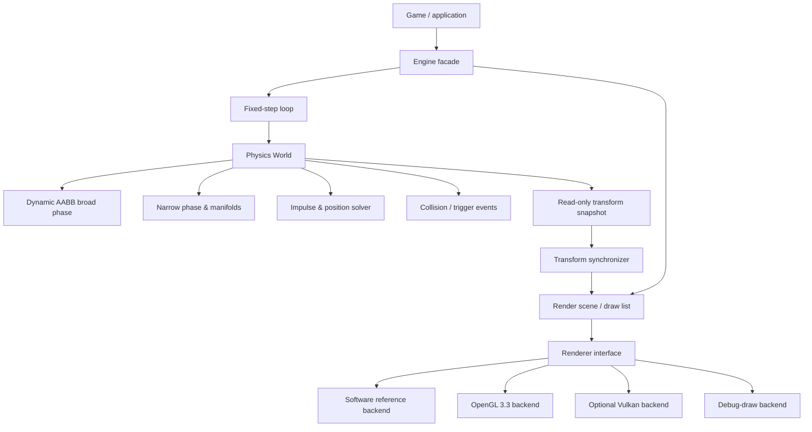

# 2D Physics & Rendering Engine — Native C++ Technical Design

## 1. Purpose

Build a small, dependable 2D engine that separates **simulation** from
**presentation**:

- deterministic, fixed-step physics for games and simulations;
- efficient rendering of primitives, sprites, and debug overlays;
- native C++ implementation, with no physics dependency on a windowing or
  graphics API;
- a compact API that runs on Windows, Linux, macOS, and headless test targets.

The engine is designed for top-down and side-view games: platformers, puzzle
games, arcade games, and editor tools. It is not a replacement for a full 3D
engine or a soft-body/fluids simulator.

## 2. Core decisions

| Concern | Decision | Why |
| --- | --- | --- |
| Language | C++20 with RAII and value types | Native performance, predictable ownership, and broad platform support. |
| Build | CMake presets + vcpkg/Conan manifest | Reproducible builds without IDE lock-in. |
| Platform layer | SDL 3 | Window, input, timer, and OpenGL context behind a thin adapter. |
| Simulation rate | Fixed `1 / 120 s` timestep | Stable, frame-rate-independent simulation. |
| Coordinates | Physics: metres, +Y up, radians | Conventional, unambiguous mechanics. |
| Display mapping | Camera maps physics +Y-up to screen +Y-down | Rendering does not contaminate physics. |
| Physics data | Numeric component stores / handles | Avoids allocating object graphs inside hot loops. |
| Broad phase | Sweep-and-prune now; dynamic AABB tree later | Deterministic pruning now, with a future high-churn upgrade path. |
| Contacts | Sequential-impulse solver with warm starting | Mature, game-ready rigid-body approach. |
| Reference renderer | Portable software rasterizer | Dependency-free correctness baseline and image-test target. |
| First GPU renderer | OpenGL 3.3 Core | Small, portable desktop GPU target with sprite batching. |
| Future renderer | Vulkan/Metal/Direct3D backend | Preserves the API while expanding platform reach. |

## 3. Architecture



`physics` never imports `render`, SDL, OpenGL, or platform headers. The
application owns the engine facade and decides which bodies have renderable
components. A synchronizer copies *interpolated* body transforms to the render
scene after each frame; it never changes simulation state.

## 4. Runtime loop

The render loop can run at any rate. Simulation never receives the variable
frame time directly. The platform layer supplies SDL events and a monotonic
timer; neither reaches the physics world.

```cpp
constexpr float fixedDt = 1.0F / 120.0F;
double accumulator = 0.0;

while (!platform.shouldQuit()) {
  platform.pumpEvents(input);
  const double nowSeconds = platform.monotonicSeconds();
  const double elapsed = std::min(nowSeconds - previousTime, 0.25);
  previousTime = nowSeconds;
  accumulator += elapsed;

  while (accumulator >= fixedDt) {
    world.step(fixedDt, input.consumeForStep());
    accumulator -= fixedDt;
  }

  const float alpha = static_cast<float>(accumulator / fixedDt);
  synchronizer.writeInterpolatedTransforms(world, scene, alpha);
  renderer.render(scene, camera);
}
```

The 250 ms clamp prevents a breakpoint, paused window, or long OS stall from
asking the engine to process an unbounded backlog. `alpha` interpolates between
the last two solved transforms so visuals remain smooth.

## 5. Physics system

### 5.1 Bodies and fixtures

`Body` stores pose, velocity, force/torque, mass properties, damping, sleep
state, and a stable `BodyId`. A `Fixture` belongs to exactly one body and adds
a shape, local pose, material, collision filter, sensor flag, and `FixtureId`.

| Body type | Behaviour |
| --- | --- |
| `static` | Infinite mass; never moved by the solver. Terrain and walls. |
| `kinematic` | Infinite mass; moved by application-set velocity. Moving platforms. |
| `dynamic` | Finite mass; moved by forces, collisions, and joints. |

Shapes in the first release are `Circle`, oriented `Box`, and arbitrary convex
`Polygon` (maximum 8 vertices). A box is represented internally as a polygon.
Capsules, chains, and concave terrain are later additions; concave geometry is
decomposed into convex fixtures rather than added to the narrow phase.

### 5.2 Step pipeline

1. Apply queued creates, destroys, filter changes, and forces at a step
   boundary.
2. Integrate forces and gravity into dynamic-body velocities using
   semi-implicit Euler.
3. Compute fixture AABBs and update moved leaves in the dynamic AABB tree.
4. Query the tree to generate potentially overlapping fixture pairs.
5. Apply category/mask/group filtering and discard invalid pairs.
6. Generate collision manifolds using circle tests and SAT with polygon
   clipping. Sensors generate overlaps but no constraints.
7. Build contact constraints, reusing cached impulses from the previous step.
8. Run 8 velocity iterations (normal impulse, restitution, and Coulomb
   friction), then 3 position-correction iterations.
9. Update sleep state, cache contacts, emit begin/persist/end contact events,
   and publish the next transform snapshot.

The default settings are deliberately visible in `WorldSettings`; users may
tune them per game without changing solver code.

### 5.3 Collision details

- A contact manifold contains one normal and up to two points. Each point
  stores penetration, feature IDs, effective mass, bias, and accumulated
  normal/tangent impulses.
- Restitution is used only when the normal closing speed is below the
  configured bounce threshold, avoiding low-speed jitter.
- Friction uses the geometric mean of fixture friction values; restitution
  uses the maximum value. These rules are configurable material callbacks.
- Position correction uses a slop and partial Baumgarte correction; it avoids
  visible sinking without injecting excessive kinetic energy.
- A sensor participates in broad/narrow phase and event delivery only.

### 5.4 Stability features

- **Warm starting:** carry matching contact impulses between steps.
- **Sleeping:** sleep stable dynamic bodies after a configurable time; wake on
  force, torque, or an explicit velocity change. Island-wide wake propagation
  follows with joints and contact caching.
- **Continuous collision detection:** a `bullet` dynamic body uses swept AABB
  broad-phase candidates and a time-of-impact shape cast against static or
  kinematic fixtures. Resolve the earliest impact, then finish the remaining
  portion of the step with a bounded sub-step count.
- **Islands:** solve connected awake bodies, contacts, and joints together so
  sleep and constraint propagation are coherent.

### 5.5 Queries and events

Queries are synchronous read operations against the current broad-phase state:

```cpp
world.queryAabb(bounds, [](const Fixture& fixture) { return QueryControl::Continue; });
world.rayCast(from, to, [](const RayHit& hit) { return RayControl::ClipToHit; });
world.shapeCast(shape, startTransform, translation, options);
```

Events are buffered during `step()` and delivered only after solving. This
makes it safe to queue destruction or spawn logic from an event handler.

```cpp
world.events().onBeginContact([](const ContactEvent& event) {});
world.events().onEndContact([](const ContactEvent& event) {});
world.events().onBeginTrigger([](const TriggerEvent& event) {});
```

User callbacks must not mutate the world mid-step. Mutations are queued and
made visible at the start of the next step.

## 6. Renderer

### 6.1 Renderer contract

The renderer consumes a stable, sorted `DrawList`, not physics bodies. This
keeps gameplay rendering flexible and makes a headless physics build possible.

```cpp
class IRenderer {
public:
  virtual ~IRenderer() = default;
  virtual void beginFrame(RenderTarget& target, const Camera2D& camera) = 0;
  virtual void submit(const DrawList& drawList) = 0;
  virtual void endFrame() = 0;
  virtual void resize(std::uint32_t width, std::uint32_t height,
                      float pixelRatio) = 0;
};
```

A draw command has a layer, stable sort key, transform, opacity, blend mode,
and one payload: sprite, coloured quad, circle, line, text, or tile batch.
The `DrawList` sorts opaque commands by layer/material/texture and retains
stable painter order for transparent commands.

### 6.2 Camera and transforms

`Camera2D` contains position, rotation, zoom, viewport, clear colour, and
optional pixel-snapping. Its world-to-screen matrix applies the Y inversion at
the rendering boundary. Physics values are therefore never negated in game
logic.

Use this transform order for renderables:

`screen = projection × cameraInverse × worldTransform × localTransform × vertex`

Sprites use a normalized anchor (`0,0` top-left; `.5,.5` center). Rectangles
and circles are expressed in world metres and scaled by camera zoom.

### 6.3 Backends

| Backend | Role | Notes |
| --- | --- | --- |
| `SoftwareRenderer` | Reference and testing backend | Rasterizes primitives to an in-memory image with no platform dependency. |
| `OpenGLRenderer` | GPU primitive and sprite backend | OpenGL 3.3 Core, shader-based colored geometry, textures, and dynamic vertex batching. |
| `NullRenderer` | Headless tests and servers | Accepts draw lists without creating a GPU context. |
| `VulkanRenderer` | Optional high-scale backend | Uses the same draw-list contract when a lower-level GPU backend is needed. |
| `DebugRenderer` | Physics diagnostics | Draws AABBs, contacts, normals, joints, and sleeping bodies. |

All backends implement the same renderer contract. `SoftwareRenderer` is the
reference implementation; GPU backends are introduced only after draw-list
semantics and image tests are stable. The SDL sandbox is a presentation adapter
that uploads reference frames to a native window; it is not a core dependency.

## 7. Public API sketch

```cpp
World world{WorldSettings{.gravity = {0.0F, -9.81F}}};
Body& floor = world.createBody({.type = BodyType::Static, .position = {0, -4}});
floor.createFixture({.shape = Shape::box(20, 0.5F), .friction = 0.9F});

Body& ball = world.createBody({
    .type = BodyType::Dynamic, .position = {0, 4},
    .bullet = true, .linearDamping = 0.02F,
});
ball.createFixture({
    .shape = Shape::circle(0.35F), .density = 1.0F, .restitution = 0.35F,
});

scene.attach(ball.id(), CircleDrawable{
    .radius = 0.35F, .fill = Color::fromHex(0xFFB000FF), .layer = 2,
});
```

The public API accepts small value types such as `Vec2`, `Transform2D`, and
descriptor structs. `BodyId` and `FixtureId` are generation-checked handles,
so stale IDs fail safely in development builds. The internal solver uses
contiguous component stores and scratch arenas to avoid allocations in hot
paths.

## 8. Module layout

```text
include/engine/  public headers, grouped by core, math, physics, render, debug
src/
  core/        ids, errors, event queue, fixed-step runner
  math/        vec2, rotation, transform, mat3, aabb, numeric utilities
  physics/     world, body, fixture, shapes, broadphase, collision, solver,
               joints, queries, contact cache
  render/      camera, scene, draw-list, renderer interface, OpenGL, Vulkan
  platform/    SDL event/input/window/time adapter
  debug/       debug settings and physics-to-draw-list adapter
  assets/      texture handles, atlas metadata, loader interface
  examples/    falling shapes, raycasts, joints, stress test
  engine.hpp   umbrella header for intentional public exports
tests/
  unit/        math, shapes, manifolds, materials, camera
  physics/     deterministic scenes and regression cases
  render/      draw-list ordering and image snapshots via a headless GL context
examples/
  sandbox/     SDL desktop application with inspector and debug controls
CMakeLists.txt
CMakePresets.json
vcpkg.json     SDL 3, OpenGL loader, test framework, image decoder
```

Dependencies flow inward only: `math` and `core` know nothing about higher
layers; `physics` depends on them; `render` depends on them; `debug` may depend
on both physics and render. Examples are the only place the complete engine is
wired together.

## 9. Determinism, performance, and safety

- Never iterate unordered containers to decide solver order. Sort pairs by
  fixture IDs and allocate monotonic IDs. This gives deterministic results for
  the same engine build, inputs, CPU architecture, compiler, and settings.
- Treat determinism across CPUs and compiler configurations as a best effort,
  not a multiplayer networking guarantee. Lockstep networking requires a
  separately validated fixed-point build.
- Preallocate contact, pair, and draw-command buffers; grow them outside hot
  paths. Expose allocation and pair/contact counters in diagnostics.
- Make the world non-reentrant: `step()` throws in development if called while
  already stepping; callbacks only enqueue commands.
- Use a finite-number guard in development builds. Reject NaN/infinite public
  inputs and provide an explicit `WorldError` with the offending handle.
- Compile tests with warnings enabled (`/W4 /permissive-` or `-Wall -Wextra
  -Wpedantic`) and sanitizers in debug CI where supported.

## 10. Delivery sequence

1. **Foundation:** CMake project, math, IDs, fixed-step runner, software
   primitive renderer, SDL presentation sandbox, and debug draw.
2. **Minimum physics:** circles/boxes, static/dynamic bodies, brute-force
   broad phase, SAT manifolds, impulses, friction, and contact events.
3. **Scale and quality:** dynamic AABB tree, contact cache, sleeping, queries,
   pooling, benchmark scenes, and deterministic regression tests.
4. **Gameplay mechanics:** sensors, distance/revolute/prismatic joints,
   kinematic bodies, collision filtering, and CCD bullets.
5. **Renderer scale:** sprite assets, atlases, tile batches, OpenGL batching,
   and visual snapshot tests.

Each phase ships with a working example and test scene. Do not begin a second
GPU backend or advanced joints until basic boxes and circles are stable under a
1,000-body stress scene.

## 11. Acceptance criteria for v1

- A scene of 1,000 sleeping/moving boxes and circles runs stably for 60
  simulated seconds with no NaNs or escaped bounds in the regression suite.
- Replaying the same recorded input sequence produces matching per-step body
  transforms on the supported runtime.
- Contacts, triggers, raycasts, layers, camera pan/zoom/rotation, sprites,
  primitives, and debug overlays work through the documented API.
- Physics runs in native headless tests without SDL or a GPU; OpenGL rendering
  can be swapped for `NullRenderer` or a mock renderer.
- Profiling data reports step time, active bodies, candidate pairs, contacts,
  solver iterations, draw calls, and draw commands.
